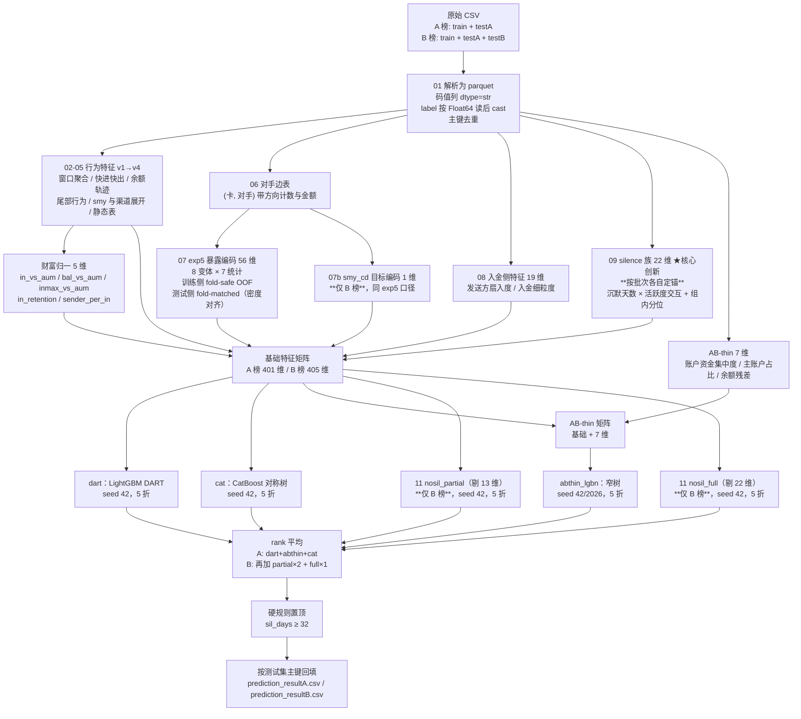

# 【选手姓名】-赛题X-审查材料说明

> 赛题：借记卡电信诈骗智能识别
>
> 本版覆盖**初赛（A 榜）与复赛（B 榜）全流程**。两个赛段的代码、中间产物、
> 模型与提交文件完全隔离，可独立复现，互不影响。

## 基本信息

| 项 | 内容 |
|---|---|
| 文件名称 | 《【选手姓名】-赛题X-审查材料说明》 |
| 联系人 UASS | 【待填写】 |
| 联系人 8 位员工编号 | 【待填写】 |
| 赛题编号 | 【待填写】 |
| **初赛（A 榜）最终成绩** | **0.917771（692/754）** |
| **复赛（B 榜）最终成绩** | **0.880637（664/754）** |
| 最终名次 | 【待填写】 |

**最快上手**：拿到材料后先运行一次交付包自检（几秒钟，不训练不预测），
它会把"缺模型 / 列顺序不一致 / 提交文件行序错位"这类问题在你花 3 小时之前
就暴露出来：

```bash
FRAUD_ROUND=B python code/selftest/verify_package.py
```

---

# 一、算法介绍

## （一）解题思路

本题给定 5 张关联数据表（交易流水、客户、卡号、账号、标注），需预测约 7.5 万张
借记卡发生电信诈骗的概率。

### 1. 评分口径决定优化方向

评分规则为：按预测概率降序取前 1% 判为欺诈，计算 F1。训练集欺诈率恰为 1%
（3000/300000），因此在 top1% 处 Precision ≈ Recall ≈ F1。由此确立三条原则：

- **只有排序重要，概率校准无意义**。所有单调变换（rank 归一化、多模型 rank
  平均）不改变得分，因此全流程统一采用 **rank 平均**融合。
- **线下验证必须复现线上口径**：`OOF 按分数取 top3000 的命中数 / 3000`，
  AUC/KS 仅作辅助。
- **testA 与 testB 均为 75,400 卡，top1% = 754**。实测线上分数恰为 754 的
  整数分之一（0.917771 = 692/754，0.880637 = 664/754），说明测试集正样本数
  亦为 754，**每命中 1 张卡 = +0.001326**。这个换算贯穿全程的方案取舍。

### 2. 时间窗口的特殊性

交易流水的窗口是「**每张卡各自最近一笔交易往前倒推 30 个自然日**」，锚点是
每卡自己的末笔交易时间，而非统一的日历日。因此：

- 所有时序特征均按**相对天数**构造（距该卡末笔的 T-1 / T-3 / T-7 / T-30）；
- 绝对日期只在确认组间无漂移后，才作为独立特征引入（见下文 silence 族）。

### 3. 核心创新：silence 特征族（22 维）

这是本方案相对常规做法的主要增量来源（**A 榜线上 +0.025**，占总提升的绝大部分）。

**出发点**不是"再想一个特征"，而是"**哪一块信息模型完全没有**"。窗口按相对
天数处理后，有一个绝对量被完全丢弃了：

```
sil_days = (该卡所属批次的末笔日期最大值) − (该卡末笔日期)
```

它刻画「这张卡沉默了多久」。电诈卡的终态是：受害人最后一笔汇入到账后，流水
戛然而止（疑似被止付/冻结），因此沉默天数显著高于正常卡。

**判别力实测**

| 指标 | 数值 |
|---|---|
| 单变量 AUC | **0.7702**（label1 均值 16.61 天 vs label0 7.92 天） |
| 与已有 299 维行为特征的最高相关 | **0.491** |

第二行是引入它的**决定性依据**——相关性只有 0.49，说明这是一块模型此前
**完全无法表达**的信息，而非已有特征的重复组合。

**与活跃度的强乘性交互**（欺诈率，行=沉默天数，列=笔数分位）

| | Q1 | Q3 | Q4 | Q5 |
|---|---|---|---|---|
| 沉默 1 天 | 0.13% | 0.14% | 0.08% | 0.14% |
| 沉默 8–14 天 | 0.31% | 1.67% | 6.09% | 25.39% |
| 沉默 15+ 天 | 0.60% | 5.33% | **22.10%** | **57.72%** |

`Q5 × 15+` 一格：835 张卡里 482 张是欺诈。三个高危格合计 3,228 张卡（占 1%），
装了 **1,034 张欺诈，占全部的 34%**。

**关键设计**：原始 `sil_days` 本身价值有限（gain 仅 260），价值几乎全部来自
**交互项**与**组内分位**：

| 特征 | 含义 | 401 维内 gain 排名 |
|---|---|---|
| `sil_pct_in_ntxn_bin` | 同笔数分箱内的沉默分位 | **第 4** |
| `ntxn_x_sil` | log(笔数) × 沉默天数 | **第 5** |
| `sil_days` | 原始沉默天数 | 第 250 名开外 |

组内分位这类特征 GBDT 学不出来（树无法在叶子内做全局排序），必须显式构造；
乘积项虽然 GBDT 能近似，显式给出可节省树深。silence 族合计占 **13.8%** 的 gain。

> **复赛的重要修正**：testB 与 train/testA 是**两个相隔约一个月的独立快照**
> （testB 末笔 2025-12-20~2026-01-31，train/testA 集中在 2025-12~2026-01-01）。
> 锚点必须**按批次各自取批次内部的末笔最大值**，不可强行统一。
> 实测若统一锚点，train 侧 label0 的 `sil_days` 均值会从 7.92 被拉到 37.92、
> `sil≥30` 占比从 1.78% 变成 100%，整族彻底失去区分度。详见 §四（一）。

### 4. 账户/余额 AB-thin 特征（7 维）

原特征主要在卡粒度聚合，但 `acct_bal` 与 `accno_txn_sn` 的自然归属是
`(card_no, cst_accno)`。一卡多账户时直接串联，容易把账户切换误当成余额跃迁。
因此先在账户内按 `(tms, accno_txn_sn)` 排序计算余额残差，再聚合到卡粒度。
最终只保留 7 个预先固定、语义互补的特征：

| 类别 | 特征 |
|---|---|
| 账户资金集中度 | `AB_acc_in_hhi`, `AB_acc_out_hhi` |
| 主账户资金占比 | `AB_primary_in_share`, `AB_primary_out_share` |
| 余额一致性 | `AB_relresid_after_mean`, `AB_acc_resid_best_p90_mean`, `AB_resid_after_p90` |

这 7 维**只加入窄树 LightGBM**，DART 与 CatBoost 仍使用基础维度。特征构造
不使用标签，只使用每卡自身流水及静态账户归属。A 榜线上由 690/754 提升到 691/754。

### 5. 暴露编码 exp5 的标签密度修正（56 维）

`exp5` 刻画「该卡的交易对手，在参考集里关联过多少张已知欺诈卡」，采用 8 个
变体（账号/名称 × 全部/出金/入金/低度数/对私）× 7 个统计量，共 56 维。

初版实现存在一处**系统性口径错位**：

| | 参考集规模 | 正样本数 |
|---|---|---|
| 训练侧（每折） | 240,000 卡 | 2,400 |
| 测试侧 | 300,000 卡 | 3,000 |

计数型统计量（`nf_max` 等）随参考集规模线性放大，导致测试侧被系统性抬高
**24.6%**（实测 `ao_nf_max` 训练侧均值 505.8 vs 测试侧 630.1，比值 1.246 =
300/240），而树的分裂阈值是在 4/5 尺度上学到的。

**修正**：第 k 折的模型，使用「以该折自己的 4/5 训练折为参考集」重算的测试
编码（fold-matched），两侧标签密度完全一致。

**验证**：仅用 56 维 exp5 训练一个分类器区分 train 与 testA（对抗验证）

| | 对抗 AUC | 最可分辨的维度 |
|---|---|---|
| 修正前 | **0.9695** | 全部是 `*_nf_max` |
| 修正后 | **0.4989** | 随机杂项 |

0.9695 意味着仅凭这 56 维就能以 97% 的判别力认出一张卡属于哪一侧；修正后
降至 0.4989（0.5 = 两侧同分布），机制完全闭环。该修正同时带来 5 份编码平均
的方差缩减，且**不改变训练侧任何内容**（OOF 完全不变）。

### 6. smy_cd 加权目标编码（1 维，**仅 B 榜**）

对高基数摘要代码 `smy_cd` 做与 exp5 完全同口径的 fold-safe / fold-matched
加权目标编码。引入依据：

- 单变量 AUC **0.7714**，与已有 299 维特征最高相关仅 **0.4767**（低于 silence
  族当初 0.491 的参考线）→ 判定为现有 Top95 one-hot 展开未覆盖的新信息
- 单一 LightGBM 5 折 OOF 快速验证：top1_f1 0.9163 → 0.9190，命中 +8

A 榜阶段接入完整三族链路后线上得分与未加时一致（均 691/754），增量与复现
噪声同量级，**故 A 榜最终提交不含该维度**；B 榜样本量更大、噪声占比更低，
纳入 B 榜链路。这也是两榜基础维度不同的原因之一。

### 7. 复赛最终配方：no-silence 双变体（B 榜核心决策）

silence 族占 13.8% gain，但它在跨批次上是**双刃剑**：

- 族内「绝对尺度量 + 交互项」共 13 维，train 与 testB 之间 PSI 高达 **0.25~2.6**
- 族内 4 个「组内分位」维度修复后 PSI 仅 **0.017 / 0.006**，跨批次完全稳定

于是训练两个屏蔽程度不同的窄树变体作为额外成员（超参、折划分、seed 与
`abthin_lgbn` 完全一致，**唯一变量是剔除的列**）：

| 变体 | 屏蔽范围 | 单族 OOF | 与三族的关系 |
|---|---|---|---|
| `nosil_full` | 全部 22 维 `S_*` | 2633（比最弱的 cat 2744 还低 111） | 够异构，但太弱 |
| `nosil_partial` | 只屏蔽 13 维不稳定量 | **2755**（超过 cat） | 够强，但太同质 |

**两难的解法不是二选一，而是同时引入并给 partial 双倍权重**：

```
最终得分 = R(mean([R(dart), R(abthin_lgbn), R(cat),
                   R(nosil_partial), R(nosil_partial), R(nosil_full)]))
```

partial 保住判别力、full 提供异构性。实测 top754 换动落在有效区间，线上由
663/754 提升到 **664/754**。

> **为什么用"重复成员"表达权重**：融合公式是 `R(mean([R(x) for x in members]))`，
> 成员在列表里出现两次即等价于权重 2。这样权重只能取整数比，**从机制上杜绝了
> 在 OOF 上做连续权重搜索**——赛中实测这种搜索会带来 0.011–0.016 的虚高。

### 8. 硬规则

train 中 `sil_days ≥ 32` 的 8 张卡**全部为欺诈**（命中率 100%），而
`sil_days = 31` 时欺诈率仅 4.72%——阈值处存在断崖。反推数据抽取规则：正常卡
要求末笔交易在窗口起点之后（以保证完整 30 天窗口），而欺诈卡从名单直接取，
不受此约束。故对测试集中满足该条件的卡直接置顶。

testB 侧该规则仅命中 1 张（train 8/300000 = 2.7e-5，testB 1/75400 = 1.3e-5，
同量级），影响不超过 1 个名次，但为保持两榜口径一致予以保留。

### 9. 模型族的选择依据

最终提交并非"线下 OOF 分数最高"的方案。在数十轮实验中观察到，线下 OOF 与
线上成绩**已经脱钩**：

| 提交方案 | 线下 OOF | 线上 TP |
|---|---|---|
| 单模 LightGBM（7 seed） | 2762 | 685 |
| dart + R9（线下最高） | **2780** | 688 |
| dart + 401 维 lgbn + cat | 2773 | 690 |
| **dart + AB-thin lgbn + cat（A 榜最终）** | 2775 | **691→692** |
| bagging（14 随机超参） | 2772 | 685 |

线下最高的方案在线上并非最好。进一步证据：同样的特征与超参，在折种子 42 下
线下为 2762–2778，换成其它折种子只有 2743–2758——**长期在同一折结构上做模型
选择，已对该折结构过拟合**，线下分数被系统性高估。

因此最终采用**成员多、结构异构**的组合：

| 成员 | 结构特点 |
|---|---|
| `dart` | LightGBM DART，训练时随机丢弃已有树 |
| `abthin_lgbn` | LightGBM 窄树（leaves=15, lr=0.03, ff=0.6）+ 7 维 AB-thin |
| `cat` | CatBoost 对称（oblivious）树 |
| `nosil_partial` ×2 / `nosil_full`（B 榜） | 同一窄树的不同特征视角 |

三者结构差异大，选择性过拟合被平均得最彻底。

> **B 榜把这条教训贯彻得更彻底**：复赛线下 OOF 92.4% 而线上 87.9%，
> gap 达 **4.6pt**（A 榜仅 0.9pt）。这意味着 **OOF 对跨批次迁移损失完全不敏感**，
> 在 B 榜阶段不能用于方案选择。详见 §四（三）。

## （二）模型流程图

> 请将下方 Mermaid 源码渲染为图片后替换本处（可用 <https://mermaid.live> 导出 PNG）。



## （三）模型介绍

### 1. 预处理阶段

按数据字典逐表分析，设计加工逻辑，全部聚合到**卡（card_no）维度**。要点：

- 码值列（`txn_channel_type` / `txn_cgycd` / `smy_cd` / `occupation` /
  `gender` / `marital_status`）含前导零，必须以 `dtype=str` 读取；
- `train.csv` 的 `label` 为 `"0.0"/"1.0"` 浮点文本，需先按 `Float64` 读入
  再 `cast` 为整型；
- 一卡多账号：`txn` 按 `(card_no, cst_accno)` 记录。AB-thin 的余额差分必须
  先在该账户键内按 `(tms, accno_txn_sn)` 排序，再聚合到卡粒度，**禁止把不同
  账户的相邻交易拼成余额轨迹**；
- **主键去重**：`card` / `cst` / `accno` 三张表合并后按各自主键去重。同一客户
  可能在 train/testA 已有卡、在 testB 又开新卡，该 `cst_id` 会出现两次，
  导致下游 join 行数膨胀（详见 §四（一）.3）；
- 缺失值（`marital_status` 49%、`industry` 82%、`ovsea_bsn_opn_ind` 48%）
  交由 LightGBM 原生处理，不填充；暴露编码缺失填 0（语义为"无暴露"）。

### 2. 训练阶段

- 5 折 `StratifiedKFold(shuffle=True, random_state=42)`；
- **折划分种子固定为 42**——`exp5` 与 `smy_te` 都是在该折下 fold-safe 生成的，
  若模型训练换用其它折种子，验证折样本的编码会包含其自身 label，构成标签泄露；
- 早停 `early_stopping(100)`，`metric="auc"`（DART 模式不支持早停，
  LightGBM 会给出警告，属正常现象，该族固定跑满 3000 轮）；
- DART 与 CatBoost 使用基础维度；窄树 LightGBM 使用基础维度 + 7 维 AB-thin；
- 融合一律用 `rankdata` 后平均，**不做连续权重搜索**（在 OOF 上搜索融合权重
  会带来 0.011–0.016 的虚高），权重只通过成员重复表达。

### 3. 输出阶段

各族 rank 归一后按配方平均，施加硬规则，最后**用测试集主键 left join 回填**
以保证行数与顺序完全一致，输出 `card_no + score` 两列 CSV。脚本内含 `assert`
校验行数与逐行卡号顺序。

---

# 二、赛段隔离：本次重组的核心设计

初赛与复赛**不共用任何中间产物与模型**：

```
data/interim_A/   model/A/    ← A 榜：参考池只有 train+testA，401/408 维
data/interim_B/   model/B/    ← B 榜：参考池含 testB，405/412 维
```

赛段由环境变量 `FRAUD_ROUND` 显式指定，**不设默认值**。

## 为什么必须隔离（这不是洁癖，是正确性问题）

`01_parse_raw.py` 在 B 榜会把 testB 并入同一份 `txn / card / cst / accno`——
这是刻意为之，因为 `cp_degree`（对手网络度）、`exp5` 暴露编码这类**跨卡图特征
必须共用参考池**，分开算会重现 A 榜踩过的"参考集口径不一致"问题。

但这同时带来两个后果，**两个都会破坏 A 榜的复现**：

1. **特征取值变了**：`occupation_freq` 等 6 个频次编码、对手网络度、exp5 的
   低度数变体，全部依赖"参考池里有哪些卡"。
2. **特征集本身也变了**：`05_features_v4.py` 按「覆盖 ≥300 张卡」的门槛筛选
   要展开的 `smy_cd` 与渠道码。testB 并入后有更多码值够到这个门槛，
   **列数随之改变**——这正是 A 榜 401 维、B 榜 405 维的主因之一
   （另一维来自 §一.6 的 smy_te）。

A 榜成绩是在 testB 尚不存在时跑出的。若在 testB 已落盘的机器上按"文件存在
就合并"的旧逻辑重跑 A 榜链路，得到的将是**另一套特征**，复现不出 A 榜成绩，
而且**不会报任何错**。

因此本版做了三处改动：

- `01_parse_raw.py`：是否读取 testB 由**赛段**决定，不由文件是否存在决定；
  A 榜即使 `data/testB/` 满着也一律不读，并明确打印提示；
- `config.py`：`INTERIM` 与 `MODEL_DIR` 按赛段分目录，两榜可任意顺序、
  重复运行，互不污染；
- `assemble.py`：是否启用 `smy_te` 由 `SPEC["use_smy_te"]` **显式决定**。
  旧版本此处无条件读取 parquet，导致原文档"跳过 07b 即可退回 A 榜维度"的
  复现说明**根本走不通**（会直接 `FileNotFoundError`）。该问题本次已修复。

---

# 三、复赛（B 榜）专项说明

## （一）修复的三个真实 bug

### 1. `01_parse_raw.py` 完全没有读取 testB 数据的代码

testA 阶段只给一个 `testa.csv`（卡号列表），交易流水已合并在
`txn_info_train_testa.csv` 里；而 B 榜给的是**5 个独立文件**，流水**不在**
原文件中。修复：testB 文件按赛段并入同一份 parquet。

### 2. silence 锚点跨批次错位

| | train label0 的 `sil_days` 均值 | `sil≥30` 占比 |
|---|---|---|
| 正确（各批次自定锚） | 7.92 | 1.78% |
| 统一锚点（错误） | **37.92** | **100%** |

修复：train+testA 与 testB **各自用批次内部的末笔日期最大值定锚**
（ANCHOR_A=2026-01-01，ANCHOR_B=2026-01-31）。修复后 train 侧数值与 A 榜
完全一致（label0 7.9161、label1 16.606）。

> 原审查材料写有"绝不可让两侧各自取自己的最大值"，该判断**在批次间隔达到
> 月级时不成立，已被实测推翻**。原计划只适用于几天量级的漂移。

### 3. `cst_id` 跨批次重复导致训练矩阵行数膨胀

同一客户可能在两批数据里各有一张卡，该 `cst_id` 在合并后出现两次。
`02_features_v1.py` 用 `cst_id` 做 join，主键不唯一导致对应的 train 卡被
"炸"成多行，训练矩阵 300000 变 300016，与 label 长度对不齐（`IndexError`）。

修复：三张静态表按各自主键去重（实测丢弃 19 条重复 `cst_id`，`keep="first"`
保留 train_testa 侧的记录，保证 train 特征与 A 榜逐字节一致）；并在
`assemble.build()` 增加行数断言，使同类问题立即报出清晰错误。

## （二）系统性排除的七个优化方向

复赛阶段与第一名相差 15 张卡（678 vs 663）。为确认这是能力上限还是工程缺陷，
对可能的优化方向做了逐一证伪。**每一条都有独立实测反证，而非"没想到"**：

| 方向 | 判死证据 |
|---|---|
| 扩候选池 / 提召回 | Top2%（6000 张）已覆盖 99.30% 正例，只有 21 张掉在外面 |
| 分群配额重标定 | ORACLE 上界（用真标签按组配额）13 个分组变量最大仅 **+3 张**，沉默分组 −3、财富分组 −6 |
| 分群组内排序 | 低活跃人群专用模型：组内命中 575→551，机构留出方向一致 **0/5** |
| 继续加特征（3 次） | 联合事件 / 资金路径 / exp5 表达方式，单模型 OOF **−5 / −13 / −7** |
| 启用被 drop 的码值 | 5 个字段中 4 个候选区 AUC ≈ 0.50~0.53；仅 `occupation` 达 0.5586，太弱 |
| 团伙图平滑 | 邻居 top1% 精度 6.60% vs 模型 top1% 精度 92.3%（14 倍差），真标签验证单调负收益 |
| 域适应 / importance weighting | 剔除 18 维后对抗 AUC 仍达 **0.9997**，两批数据在业务分布上结构性不同，重叠支撑集不成立 |

三条从中沉淀的方法论，对后续赛题同样适用：

1. **保序变换不改变得分**。评分只看测试集**内部**相对次序，单纯的全局尺度
   偏移无论 PSI 多高都基本无害。据此推翻了"按 PSI 排风险分去定点修复"的
   整条路线（花一次提交换来的教训）。
2. **先算上界，再决定要不要实现**。任何"重新分配 / 重新加权 / 后处理"类想法，
   都可以用真标签构造一个 ORACLE 上界。上界小就等于路线死——用这招在写实现
   代码之前就判死了分群重标定，成本几十秒。
3. **判断新特征看候选区 AUC，不看全局 AUC**。全局 AUC 高而候选区（决定
   top1% 入选的排名带）AUC ≈ 0.5，说明该信息只能区分头部易分样本，早被模型
   学走。前三次加特征实验栽的正是这个跟头。

## （三）两榜差距的归因

| | 线下 OOF | 线上 | gap |
|---|---|---|---|
| A 榜 | 2775/3000 = 92.5% | 692/754 = 91.8% | 0.7pt |
| B 榜 | 2772/3000 = 92.4% | 664/754 = 88.1% | **4.3pt** |

线下几乎一样而线上差 28 张。同时第一名在 B 榜约 678/754，也**显著低于我们
自己在 A 榜的 692/754**——testB 全场都更难。结论：差距主要来自
**train → testB 的结构性迁移障碍**，而非工程缺陷。

已查实的结构性差异包括：`smy2_0507` 占比 train 0.09% vs testB **1.12%（12.6 倍）**；
`sil_days = 0` 在 testB 全体占 **25.46%** 而 train 仅 0.00%（约 1.9 万张卡
"活到批次快照最后一天"，train 里几乎不存在这类卡）。

---

# 四、代码清单与运行指令

## （一）环境

```bash
pip install -r requirements.txt
```

```text
Python 3.10.16
Linux（5 CPU / 20GB 内存即可，无需 GPU）
磁盘：单赛段中间产物约 8~10GB，两榜并存约 20GB
```

严格按 `requirements.txt` 安装：`numpy==1.26.4`、`pyarrow==12.0.1`
（numpy 2.x 会让 LightGBM / CatBoost 崩溃；pyarrow 17.x 在较低版本
libstdc++ 上报 `GLIBCXX_3.4.21 not found`）。

## （二）数据放置

按 `data/README.md` 放置原始 CSV：

```text
data/train/   txn_info_train_testa.csv  card_info_train_testa.csv
              cst_info_train_testa.csv  accno_info_train_testa.csv  train.csv
data/testA/   testa.csv
data/testB/   testb.csv  txn_info_testb.csv  card_info_testb.csv
              cst_info_testb.csv  accno_info_testb.csv
```

若数据位于其它路径，设置环境变量 `FRAUD_BASE`，或修改 `code/config.py`
顶部的路径常量（全部路径集中于该文件，只需改一处）。

## （三）预处理与特征加工（11 个脚本，按编号顺序执行）

| 脚本 | 作用 | 耗时 |
|---|---|---|
| `01_parse_raw.py` | 原始 CSV → parquet，主键去重，完整性与时间锚点检查 | ~3 min |
| `02_features_v1.py` | 卡级基础特征（94 列） | ~2 min |
| `03_features_v2.py` | 尾部行为 / 对手网络 / 熵 / 金额形态（142 列） | ~2 min |
| `04_features_v3.py` | 末段序列 / 末次入金后行为 / 分散转出（174 列） | ~3 min |
| `05_features_v4.py` | smy 与渠道全量展开 + 末段小时级时间窗（300 列） | ~3 min |
| `06_edge_tables.py` | (卡, 对手) 带方向边表 | ~2 min |
| `07_exp5_encoding.py` | 暴露编码，fold-safe + fold-matched | ~8 min |
| `07b_smy_te_encoding.py` | smy_cd 目标编码（**仅 B 榜**，A 榜自动跳过） | ~2 min |
| `08_inflow_feat.py` | 入金侧 label-free 特征（19 维） | ~2 min |
| `09_silence_feat.py` | **silence 特征族（22 维）**，按批次各自定锚 | ~2 min |
| `10_train_models.py` | AB-thin 构造 + 训练 dart / abthin_lgbn / cat 三族 | ~110 min |
| `11_train_nosil.py` | no-silence 两族（**仅 B 榜**，A 榜自动跳过） | ~20 min |

特征矩阵的最终组装由 `code/assemble.py` 完成，**训练与预测共用同一份代码**，
从机制上杜绝两侧口径漂移。财富归一 5 维在该模块内计算。
`code/account_balance.py` 由第 10 步自动调用，不使用标签，无需单独执行。

## （四）一键训练

```bash
bash code/scripts/run_train.sh A     # 初赛，约 2.5 小时
bash code/scripts/run_train.sh B     # 复赛，约 2.9 小时
```

脚本会按赛段自动跳过不适用的步骤（A 榜跳过 07b 与 11）。
**不传赛段参数会直接报错退出**——这是刻意设计，跑错赛段会静默浪费 2.5 小时。

**训练产出**

| 路径 | 内容 |
|---|---|
| `model/{A,B}/dart_s42_f{0..4}.txt` | DART，5 个 |
| `model/{A,B}/abthin_lgbn_s{42,2026}_f{0..4}.txt` | AB-thin 窄树，10 个 |
| `model/{A,B}/cat_s42_f{0..4}.cbm` | CatBoost，5 个 |
| `model/B/nosil_{partial,full}_s42_f{0..4}.txt` | **仅 B 榜**，10 个 |
| `model/{A,B}/feature_cols.json` | 基础列顺序 |
| `model/{A,B}/account_balance_thin_feature_cols.json` | AB-thin 列顺序 |
| `model/B/nosil_{partial,full}_feature_cols.json` | **仅 B 榜**，各变体列顺序 |
| `data/interim_{A,B}/oof_*.npy`、`te_*.npy` | OOF 与测试侧预测，供线下核对 |

## （五）预测

```bash
bash code/scripts/run_predict.sh A   # -> prediction_result/prediction_resultA.csv
bash code/scripts/run_predict.sh B   # -> prediction_result/prediction_resultB.csv
```

该脚本**只加载 `model/{赛段}/` 下已训练好的模型，不重新训练**，约 3~5 分钟。
模型保存时已按 `best_iteration` 截断，预测时无需再传迭代数。

若只拿到随材料提交的 `model/` 而缺少中间产物，先补齐特征（约 25 分钟）：

```bash
bash code/scripts/run_features.sh B && bash code/scripts/run_predict.sh B
```

## （六）代码结构

```text
赛题X-借记卡电信诈骗智能识别/
│
├── 【选手姓名】-赛题X-审查材料说明.pdf   # 本文档
├── B榜优化过程记录.md                    # 复赛完整实验记录（含全部被否定方向）
├── requirements.txt
│
├── data/
│   ├── README.md                         # 数据放置说明（数据本身未打包）
│   ├── train/  testA/  testB/            # 原始 CSV
│   ├── interim_A/                        # A 榜中间产物（脚本自动生成）
│   └── interim_B/                        # B 榜中间产物（脚本自动生成）
│
├── model/
│   ├── A/                                # A 榜 20 个模型 + 2 份列顺序
│   └── B/                                # B 榜 30 个模型 + 4 份列顺序
│
├── prediction_result/
│   ├── prediction_resultA.csv            # 初赛最终提交（0.917771）
│   └── prediction_resultB.csv            # 复赛最终提交（0.880637）
│
└── code/
    ├── config.py                         # 路径、赛段规格、折种子、超参、最终配方
    ├── assemble.py                       # 特征矩阵组装（训练/预测共用）
    ├── account_balance.py                # 固定 7 维 AB-thin（训练/预测共用）
    │
    ├── train/   01 ~ 11                  # 预处理、特征加工、训练
    ├── test/    predict.py               # 加载模型 -> 提交文件
    ├── scripts/ run_train.sh  run_predict.sh  run_features.sh
    ├── selftest/                         # 交付包自检与合成数据端到端测试
    │   ├── verify_package.py             # 静态校验，几秒钟
    │   ├── make_synth_data.py            # 生成仿真结构的微型数据
    │   └── e2e_test.py                   # 两赛段全链路跑通验证
    └── explore/  labB/                   # 研究过程脚本，**不属于复现链路**
```

> `code/explore/` 与 `code/labB/` 保留的是赛中诊断与被否定方向的实现
> （见 §三（二））。它们不参与复现，但构成 B 榜结论的证据链，故一并归档。

## （七）复现情况预估

**路径一（推荐）：直接用随材料提交的 `model/` 执行预测，不重新训练。**
误差严格为 0。依据：

1. `predict.py` 直接加载落盘模型，与训练时的 `best_iteration` 完全一致
   （保存时已用 `num_iteration=best_iteration` 截断）；
2. 特征加工全部为确定性聚合，不含采样；
3. 融合为固定配方的 rank 平均，无权重搜索；
4. 输出前有行数与逐行卡号顺序的 `assert` 校验。

**路径二：从零重跑 `run_train.sh`。**
折划分 `random_state=42`、各模型 `seed` 均在 `config.FINAL_RECIPE` /
`config.NOSIL_SEED` 中显式指定，流程本身无随机性未受控环节。但 LightGBM 在
不同 CPU 核数 / 硬件环境下的浮点累加顺序可能产生微小差异，导致
`best_iteration` 存在极小概率偏移。

**预估 top754 变动不超过 3 张卡。** 这一点有实测记录：A 榜原始提交为
0.916446（691/754），评审环境下按路径二从零重跑一次完整训练+预测后提交，
得分 **0.917771（692/754）**，多命中 1 张，落在预估范围内。本材料以后者
作为 A 榜最终成绩。

> **需要如实说明的一点**：A 榜与 B 榜均已截止，无法再次提交验证。
> 随材料提交的 `model/` 是按本包代码重新训练并落盘的，路径一能保证
> 与该批模型产出的预测文件完全一致；但**该批模型本身与当初取得官方成绩的
> 那批模型之间，仍可能存在上述 ±3 卡的浮点差异**，且这一差异已无法通过
> 线上提交来核验。若对精确复现有严格要求，请以上述机制说明与 ±3 卡的
> 误差预估为准。

---

# 五、常见问题解答

## 问题 1：为什么必须用 `FRAUD_ROUND` 指定赛段？

见 §二。简言之：参考池不同会同时改变**特征取值**与**特征集列数**，
而这种错误不会报错，只会静默给出另一套结果。刻意不设默认值，是因为赛中
曾因 `TARGET` 默认 `testa` 而静默跑错 2.5 小时。

## 问题 2：silence 特征的时间锚点

`sil_days` 依赖锚点，该族贡献 13.8% gain，锚点错位会导致成绩大幅下滑。
锚点已写入 `data/interim_{A,B}/silence_anchor.json`，可追溯。

正确做法是**按批次各自定锚**（A 榜只有一个批次；B 榜 train+testA 与 testB
各自定锚）。语义上仍是"该卡距其所属批次快照时间点的沉默天数"，两批次可比，
且不破坏 train 侧已验证过的分布。原文档中"绝不可让两侧各自取自己的最大值"
的判断已被 B 榜实测推翻，详见 §三（一）.2。

## 问题 3：折划分种子为什么不可更改？

`exp5` 与 `smy_te` 都是在 `StratifiedKFold(5, random_state=42)` 下 fold-safe
生成的：每折的编码只使用其余 4 折的 label。若模型训练换用其它折种子，新的
验证折样本会落入旧编码的"训练折"中，其编码包含自身 label，构成泄露
（表现为线下 OOF 异常升高、线上崩溃）。

如确需更换折种子，必须**整套重建**编码（训练侧 OOF + 5 份 fold-matched
测试编码），即以新种子重跑 `07` / `07b` 并删除旧缓存。

## 问题 4：内存与磁盘

`txn` 表约 997 万行 / 2.2GB（B 榜含 testB 后更大）；`06` 与 `07` 需同时载入
两张 450 万行的边表并派生 8 个变体。实测在 5 CPU / 20GB 环境下可稳定运行，
峰值约 4GB。各脚本已做分步落盘与 `del` + `gc.collect()` 释放。

磁盘方面，两个赛段的中间产物各约 8~10GB。若空间紧张，可在 A 榜预测完成后
删除 `data/interim_A/`（保留 `model/A/` 与提交文件）；需要再次预测 A 榜时，
用 `bash code/scripts/run_features.sh A` 重新生成，约 25 分钟。

## 问题 5：中间产物已存在时的行为

`07_exp5_encoding.py` 对已存在的编码文件会跳过重算，`account_balance.py`
会复用已有的 `account_balance_v1.parquet`。这是为断点续跑设计的。
若需强制重算（例如更换了折种子），请删除
`data/interim_{赛段}/exp5_tr.parquet` 与 `exp5_te*_f*.parquet`；
若需重算账户特征，删除 `account_balance_v1.parquet` 后重跑第 10 步。
其余脚本均为无条件覆盖写入。

## 问题 6：DART 模式的早停警告

训练 `dart` 族时 LightGBM 会打印
`UserWarning: Early stopping is not available in dart mode`。
这是**正常现象**：DART 每轮随机丢弃已有树，验证曲线不单调，无法早停，
该族固定跑满 3000 轮。这也是它占用约 78 分钟、成为训练主要开销的原因。

## 问题 7：线下 OOF 和线上对不上

这是本赛题最需要注意的一点，见 §一.9 与 §三（三）。A 榜 gap 0.7pt 尚可参考，
**B 榜 gap 达 4.3pt，线下 OOF 已不能用于方案选择**。B 榜阶段的所有方案取舍
都改用了"换入正例 / 换出正例的比值"与"固定业务分组留出"作为判据，
详见 `B榜优化过程记录.md`。
