# 【选手姓名】-赛题X-审查材料说明

> 赛题：借记卡电信诈骗智能识别。本版覆盖初赛（A 榜）与复赛（B 榜）。
> 两个赛段的中间产物、模型与提交文件完全隔离，可独立复现。

## 基本信息

| 项 | 内容 |
|---|---|
| 文件名称 | 《【选手姓名】-赛题X-审查材料说明》 |
| 联系人 UASS | 【待填写】 |
| 联系人 8 位员工编号 | 【待填写】 |
| 赛题编号 | 【待填写】 |
| **初赛（A 榜）成绩** | **0.917771（692/754）** |
| **复赛（B 榜）成绩** | **0.880637（664/754）** |
| 最终名次 | 【待填写】 |

**建议第一步**（几秒钟，不训练不预测，先确认交付包完整）：

```bash
FRAUD_ROUND=B PYTHONPATH=code python code/selftest/verify_package.py
```

---

# 一、算法介绍

## （一）解题思路

**评分口径决定优化方向。** 按预测概率降序取前 1% 判为欺诈算 F1，训练集欺诈率
恰为 1%（3000/300000），故在 top1% 处 Precision ≈ Recall ≈ F1。由此确立：

- **只有排序重要，概率校准无意义**。所有单调变换不改变得分，全流程统一用
  **rank 平均**融合。
- **线下验证复现线上口径**：`OOF 取 top3000 的命中数 / 3000`，AUC 仅作辅助。
- testA / testB 均为 75,400 卡，top1% = 754。线上分数恰为 754 的整数分之一
  （0.917771 = 692/754，0.880637 = 664/754），**每命中 1 张卡 = +0.001326**。

**时间窗口是相对的。** 流水窗口为「每张卡各自最近一笔交易往前倒推 30 个自然日」，
锚点是每卡自己的末笔时间而非统一日历日。因此所有时序特征按**相对天数**构造
（距末笔的 T-1 / T-3 / T-7 / T-30）；绝对日期只在确认组间无漂移后才引入。

## （二）关键方法

### 1. silence 特征族（22 维，核心创新）

窗口按相对天数处理后，有一个绝对量被完全丢弃了：

```
sil_days = (该卡所属批次的末笔日期最大值) − (该卡末笔日期)
```

它刻画「这张卡沉默了多久」。电诈卡的终态是受害人最后一笔汇入到账后流水戛然
而止（疑似被止付冻结），沉默天数显著高于正常卡。

| 指标 | 数值 |
|---|---|
| 单变量 AUC | **0.7702**（label1 均值 16.61 天 vs label0 7.92 天） |
| 与已有 299 维行为特征的最高相关 | **0.491** |

第二行是引入它的决定性依据：相关性只有 0.49，说明这是模型此前**完全无法
表达**的信息，而非已有特征的重复组合。

价值几乎全部来自**交互项**与**组内分位**，而非原始值：

| 特征 | 含义 | 全矩阵内 gain 排名 |
|---|---|---|
| `sil_pct_in_ntxn_bin` | 同笔数分箱内的沉默分位 | 第 4 |
| `ntxn_x_sil` | log(笔数) × 沉默天数 | 第 5 |
| `sil_days` | 原始沉默天数 | 250 名开外 |

组内分位 GBDT 学不出来（树无法在叶子内做全局排序），必须显式构造。
沉默天数与活跃度呈强乘性交互：`笔数Q5 × 沉默15天+` 这一格 835 张卡里 482 张
是欺诈；三个高危格合计占全量 1%，装了 34% 的欺诈卡。该族占模型 **13.8%** gain，
A 榜线上兑现 **+0.0239**。

> **锚点必须按批次各自确定。** testB 与 train/testA 是相隔约一个月的两个独立
> 快照（testB 末笔 2025-12-20~2026-01-31，train/testA 集中在 2025-12~2026-01-01）。
> 实测若强行统一锚点，train 侧 label0 的 `sil_days` 均值从 7.92 被拉到 37.92、
> `sil≥30` 占比从 1.78% 变成 100%，整族失去区分度。

### 2. 账户/余额 AB-thin（7 维）

`acct_bal` 与 `accno_txn_sn` 的自然归属是 `(card_no, cst_accno)`。一卡多账户时
直接串联，会把账户切换误当成余额跃迁。因此先在账户内按 `(tms, accno_txn_sn)`
排序算余额残差，再聚合到卡粒度，只保留 7 个预先固定、语义互补的特征：账户
资金集中度 2、主账户资金占比 2、余额一致性 3。

这 7 维**只加入窄树 LightGBM**，DART 与 CatBoost 不用。不使用标签。

### 3. exp5 暴露编码的标签密度修正（56 维）

exp5 刻画「该卡的交易对手，在参考集里关联过多少张已知欺诈卡」，8 变体
（账号/名称 × 全部/出金/入金/低度数/对私）× 7 统计量。

初版存在系统性口径错位：训练侧每折参考集 240,000 卡 / 2,400 正，测试侧
300,000 卡 / 3,000 正。计数型统计量随参考集规模线性放大，测试侧被系统性抬高
**24.6%**（实测 `ao_nf_max` 均值 505.8 vs 630.1，比值 1.246 = 300/240），
而树的分裂阈值是在 4/5 尺度上学到的。

**修正为 fold-matched**：第 k 折的模型，使用「以该折自己的 4/5 训练折为参考集」
重算的测试编码，两侧标签密度完全一致。

验证（仅用这 56 维做对抗验证，区分 train 与 testA）：

| | 对抗 AUC | 最可分辨的维度 |
|---|---|---|
| 修正前 | **0.9695** | 全部是 `*_nf_max` |
| 修正后 | **0.4989** | 随机杂项 |

该修正不改变训练侧任何内容（OOF 完全不变），并带来 5 份编码平均的方差缩减。

### 4. smy_cd 加权目标编码（1 维，仅 B 榜）

对高基数摘要代码做与 exp5 完全同口径的 fold-safe / fold-matched 加权目标编码。
依据：单变量 AUC **0.7714**，与已有 299 维特征最高相关仅 **0.4767**，判定为
现有 Top95 one-hot 展开未覆盖的新信息。

A 榜阶段实测增量与复现噪声同量级，**A 榜最终提交不含该维度**；B 榜样本量更大、
噪声占比更低，纳入 B 榜链路。这是两榜基础维度不同的原因之一。

### 5. no-silence 双变体（B 榜最终配方）

silence 族占 13.8% gain，但跨批次是双刃剑：族内 13 维「绝对尺度量 + 交互项」
在 train 与 testB 之间 PSI 高达 0.25~2.6；而 4 个「组内分位」维度 PSI 仅
0.017 / 0.006，跨批次完全稳定。

于是训练两个屏蔽程度不同的窄树变体（超参、折划分、seed 与 `abthin_lgbn` 完全
一致，**唯一变量是剔除的列**）：

| 变体 | 屏蔽范围 | 单族 OOF | 与三族的关系 |
|---|---|---|---|
| `nosil_full` | 全部 22 维 `S_*` | 2633（低于最弱的 cat 2744） | 够异构，但太弱 |
| `nosil_partial` | 只屏蔽 13 维不稳定量 | **2755**（超过 cat） | 够强，但太同质 |

解法不是二选一，而是同时引入并给 partial 双倍权重：

```
最终得分 = R(mean([R(dart), R(abthin_lgbn), R(cat),
                   R(nosil_partial), R(nosil_partial), R(nosil_full)]))
```

partial 保住判别力、full 提供异构性。线上由 663/754 提升到 **664/754**。

> **权重用"重复成员"表达。** 融合公式是 `R(mean([R(x) for x in members]))`，
> 成员出现两次即等价于权重 2。这样权重只能取整数比，**从机制上杜绝了在 OOF 上
> 做连续权重搜索** —— 实测这种搜索会带来 0.011–0.016 的虚高。

### 6. 硬规则

train 中 `sil_days ≥ 32` 的 8 张卡全部为欺诈（100%），而 `sil_days = 31` 时
欺诈率仅 4.72%，阈值处存在断崖。反推数据抽取规则：正常卡要求末笔交易在窗口
起点之后（以保证完整 30 天窗口），而欺诈卡从名单直接取，不受此约束。故对
测试集中满足该条件的卡直接置顶。testB 侧仅命中 1 张，为保持两榜口径一致予以保留。

### 7. 模型族与融合

最终提交**不是**线下 OOF 最高的方案。线下与线上已经脱钩：

| 提交方案 | 线下 OOF | 线上 TP |
|---|---|---|
| dart + R9（线下最高） | **2780** | 688 |
| dart + 401 维 lgbn + cat | 2773 | 690 |
| **dart + AB-thin lgbn + cat（A 榜最终）** | 2775 | **692** |

进一步证据：同样的特征与超参，在折种子 42 下线下 2762–2778，换其它折种子只有
2743–2758 —— 长期在同一折结构上做模型选择，已对该折结构过拟合。

因此采用**成员多、结构异构**的组合：DART（训练时随机丢弃已有树）、
LightGBM 窄树（leaves=15, lr=0.03, ff=0.6）、CatBoost 对称树，
B 榜再加两个同一窄树的不同特征视角。结构差异大，选择性过拟合被平均得最彻底。

> **B 榜把这条贯彻得更彻底**：复赛线下 OOF 92.4% 而线上 88.1%，gap **4.3pt**
> （A 榜仅 0.7pt）。OOF 对跨批次迁移损失完全不敏感，在 B 榜不能用于方案选择。

## （三）模型流程图

```mermaid
flowchart TD
    A["原始 CSV<br/>A 榜: train + testA<br/>B 榜: train + testA + testB"] --> B["01 解析为 parquet<br/>码值列 dtype=str，label 按 Float64 读后 cast<br/>静态表按主键去重"]

    B --> C1["02-05 行为特征<br/>窗口聚合 / 快进快出 / 余额轨迹<br/>尾部行为 / smy 与渠道展开 / 静态表"]
    B --> C2["06 对手边表<br/>(卡, 对手) 带方向计数与金额"]
    B --> C3["08 入金侧特征 19 维<br/>发送方扇入度 / 入金细粒度"]
    B --> C4["09 silence 族 22 维 ★核心创新<br/>按批次各自定锚<br/>沉默天数 × 活跃度交互 + 组内分位"]
    B --> C5["AB-thin 7 维<br/>账户资金集中度 / 主账户占比 / 余额残差"]

    C2 --> D["07 exp5 暴露编码 56 维<br/>训练侧 fold-safe，测试侧 fold-matched"]
    C2 --> D2["07b smy_cd 目标编码 1 维<br/>仅 B 榜"]
    C1 --> E["财富归一 5 维"]

    C1 --> F["基础特征矩阵<br/>A 榜 401 维 / B 榜 405 维"]
    C3 --> F
    C4 --> F
    D --> F
    D2 --> F
    E --> F

    F --> G1["dart：LightGBM DART，seed 42"]
    F --> G3["cat：CatBoost 对称树，seed 42"]
    F --> F2["AB-thin 矩阵（基础 + 7 维）"]
    C5 --> F2
    F2 --> G2["abthin_lgbn：窄树，seed 42/2026"]
    F --> G4["11 nosil_partial（剔 13 维），仅 B 榜"]
    F --> G5["11 nosil_full（剔 22 维），仅 B 榜"]

    G1 --> H["rank 平均<br/>A: dart+abthin+cat<br/>B: 再加 partial×2 + full×1"]
    G2 --> H
    G3 --> H
    G4 --> H
    G5 --> H
    H --> I["硬规则置顶 sil_days ≥ 32"]
    I --> J["按测试集主键回填<br/>prediction_resultA.csv / prediction_resultB.csv"]
```

> 请将下方 Mermaid 源码渲染为图片后替换本处（<https://mermaid.live> 可导出 PNG）。



## （四）实现要点

**预处理**（全部聚合到卡粒度）

- 码值列（`txn_channel_type` / `txn_cgycd` / `smy_cd` / `occupation` / `gender` /
  `marital_status`）含前导零，必须 `dtype=str` 读取；
- `train.csv` 的 `label` 是 `"0.0"/"1.0"` 浮点文本，需先按 `Float64` 读入再 cast；
- AB-thin 的余额差分必须先在 `(card_no, cst_accno)` 内排序，**禁止把不同账户的
  相邻交易拼成余额轨迹**；
- `card` / `cst` / `accno` 三张表合并后按各自主键去重。同一客户可能在两批数据里
  各有一张卡，`cst_id` 重复会让下游 join 行数膨胀（实测丢弃 19 条重复记录）；
- 缺失值（`marital_status` 49%、`industry` 82%）交由 LightGBM 原生处理，不填充；
  暴露编码缺失填 0（语义为"无暴露"）。

**训练**

- 5 折 `StratifiedKFold(shuffle=True, random_state=42)`；
- **折种子固定为 42 不可更改** —— exp5 与 smy_te 都是在该折下 fold-safe 生成的，
  换折会使验证折样本的编码包含自身 label，构成泄露；
- 早停 `early_stopping(100)`，`metric="auc"`。DART 模式不支持早停，LightGBM 会
  给出警告，属正常现象，该族固定跑满 3000 轮；
- 融合一律 rank 平均，不做连续权重搜索。

**输出**：各族 rank 归一后按配方平均，施加硬规则，最后用测试集主键 left join
回填保证行数与顺序一致，输出 `card_no + score` 两列。脚本内含 `assert` 校验。

---

# 二、赛段隔离（正确性要求）

两个赛段不共用任何中间产物与模型：

```
data/interim_A/   model/A/    ← A 榜：参考池只有 train+testA，401/408 维
data/interim_B/   model/B/    ← B 榜：参考池含 testB，405/412 维
```

赛段由环境变量 `FRAUD_ROUND` 显式指定，**不设默认值**。

**为什么必须隔离。** `01_parse_raw.py` 在 B 榜会把 testB 并入同一份
`txn / card / cst / accno` —— 这是刻意为之，`cp_degree`（对手网络度）、exp5
暴露编码这类**跨卡图特征必须共用参考池**。但参考池一变，两件事同时变：

1. **特征取值**：`occupation_freq` 等 6 个频次编码、对手网络度、exp5 低度数变体，
   全都依赖"池子里有哪些卡"；
2. **特征集本身**：`05_features_v4.py` 按「覆盖 ≥300 张卡」的门槛决定展开哪些
   摘要码与渠道码，testB 并入后更多码值够到门槛，**列数随之改变**。

A 榜成绩是在 testB 尚不存在时跑出的。若在 testB 已落盘的机器上按"文件存在就
合并"去重跑 A 榜链路，得到的是另一套特征，**而且不会报任何错**。因此 A 榜
即使 `data/testB/` 满着也一律不读。

---

# 三、代码清单与运行指令

## （一）环境

```bash
pip install -r requirements.txt
```

```text
Python 3.10.16 / Linux / 5 CPU / 20GB 内存，无需 GPU
磁盘：单赛段中间产物约 8~10GB，两榜并存约 20GB
```

严格按 `requirements.txt` 安装：`numpy==1.26.4`、`pyarrow==12.0.1`。
numpy 2.x 会让 LightGBM / CatBoost 崩溃；pyarrow 17.x 在较低版本 libstdc++ 上
报 `GLIBCXX_3.4.21 not found`。

## （二）数据放置

按 `data/README.md` 放置原始 CSV 到 `data/train/`、`data/testA/`、`data/testB/`。
若数据在别处，设置 `FRAUD_BASE` 环境变量，或修改 `code/config.py` 顶部的路径常量
（全部路径集中于该文件，只需改一处）。

## （三）脚本清单（按编号顺序执行）

| 脚本 | 作用 | 耗时 |
|---|---|---|
| `01_parse_raw.py` | 原始 CSV → parquet，主键去重，完整性与时间锚点检查 | ~3 min |
| `02_features_v1.py` | 卡级基础特征（94 列） | ~2 min |
| `03_features_v2.py` | 尾部行为 / 对手网络 / 熵 / 金额形态（142 列） | ~2 min |
| `04_features_v3.py` | 末段序列 / 末次入金后行为 / 分散转出（174 列） | ~3 min |
| `05_features_v4.py` | smy 与渠道全量展开 + 末段小时级时间窗（300 列） | ~3 min |
| `06_edge_tables.py` | (卡, 对手) 带方向边表 | ~2 min |
| `07_exp5_encoding.py` | 暴露编码，fold-safe + fold-matched | ~8 min |
| `07b_smy_te_encoding.py` | smy_cd 目标编码（**仅 B 榜**，A 榜自动跳过） | ~2 min |
| `08_inflow_feat.py` | 入金侧 label-free 特征（19 维） | ~2 min |
| `09_silence_feat.py` | **silence 特征族（22 维）**，按批次各自定锚 | ~2 min |
| `10_train_models.py` | AB-thin 构造 + 训练 dart / abthin_lgbn / cat | ~110 min |
| `11_train_nosil.py` | no-silence 两族（**仅 B 榜**，A 榜自动跳过） | ~20 min |

特征矩阵的最终组装由 `code/assemble.py` 完成，**训练与预测共用同一份代码**，
从机制上杜绝两侧口径漂移；财富归一 5 维在该模块内计算。
`code/account_balance.py` 由第 10 步自动调用，不使用标签，无需单独执行。

## （四）一键训练

```bash
bash code/scripts/run_train.sh A     # 初赛，约 2.5 小时
bash code/scripts/run_train.sh B     # 复赛，约 2.9 小时
```

按赛段自动跳过不适用的步骤。**不传赛段参数会直接报错退出** —— 刻意设计，
跑错赛段会静默浪费 2.5 小时。

**训练产出**

| 路径 | 内容 |
|---|---|
| `model/{A,B}/dart_s42_f{0..4}.txt` | DART，5 个 |
| `model/{A,B}/abthin_lgbn_s{42,2026}_f{0..4}.txt` | AB-thin 窄树，10 个 |
| `model/{A,B}/cat_s42_f{0..4}.cbm` | CatBoost，5 个 |
| `model/B/nosil_{partial,full}_s42_f{0..4}.txt` | 仅 B 榜，10 个 |
| `model/{A,B}/*feature_cols*.json` | 各矩阵的列顺序 |
| `data/interim_{A,B}/oof_*.npy`、`te_*.npy` | OOF 与测试侧预测，供线下核对 |

## （五）预测

```bash
bash code/scripts/run_predict.sh A   # -> prediction_result/prediction_resultA.csv
bash code/scripts/run_predict.sh B   # -> prediction_result/prediction_resultB.csv
```

**只加载已训练好的模型，不重新训练**，约 3~5 分钟。模型保存时已按
`best_iteration` 截断，预测时无需再传迭代数。

若只拿到 `model/` 而缺少中间产物，先补齐特征（约 25 分钟）：

```bash
bash code/scripts/run_features.sh B && bash code/scripts/run_predict.sh B
```

## （六）交付包自检

```bash
FRAUD_ROUND=A PYTHONPATH=code python code/selftest/verify_package.py
FRAUD_ROUND=B PYTHONPATH=code python code/selftest/verify_package.py
```

静态校验原始数据、中间产物、列顺序一致性、融合配方所需的模型是否齐备、
提交文件的行数与逐行卡号顺序，几秒钟出结果。

`code/selftest/` 另含合成数据端到端测试（`make_synth_data.py` + `e2e_test.py`），
可在不接触真实数据的前提下验证两个赛段的完整链路。

## （七）代码结构

```text
赛题X-借记卡电信诈骗智能识别/
├── 【选手姓名】-赛题X-审查材料说明.pdf
├── requirements.txt
├── data/
│   ├── README.md                     # 数据放置说明（数据本身未打包）
│   ├── train/  testA/  testB/        # 原始 CSV
│   └── interim_A/  interim_B/        # 中间产物，脚本自动生成
├── model/
│   ├── A/                            # 20 个模型 + 2 份列顺序
│   └── B/                            # 30 个模型 + 4 份列顺序
├── prediction_result/
│   ├── prediction_resultA.csv        # 初赛提交（0.917771）
│   └── prediction_resultB.csv        # 复赛提交（0.880637）
└── code/
    ├── config.py                     # 路径、赛段规格、折种子、超参、最终配方
    ├── assemble.py                    # 特征矩阵组装（训练/预测共用）
    ├── account_balance.py             # 固定 7 维 AB-thin（训练/预测共用）
    ├── train/   01 ~ 11
    ├── test/    predict.py
    ├── scripts/ run_train.sh  run_predict.sh  run_features.sh
    └── selftest/ verify_package.py  compare_submission.py
                  make_synth_data.py  e2e_test.py
```

---

# 四、复现情况预估

**路径一（推荐）：用随材料提交的 `model/` 直接预测，不重新训练。** 误差为 0：

1. `predict.py` 直接加载落盘模型，与训练时的 `best_iteration` 完全一致
   （保存时已用 `num_iteration=best_iteration` 截断）；
2. 特征加工全部为确定性聚合，不含采样；
3. 融合为固定配方的 rank 平均，无权重搜索；
4. 输出前有行数与逐行卡号顺序的 `assert` 校验。

该等价性已用合成数据端到端验证：落盘模型的预测与训练时保存的 `te_*.npy`
**排序完全一致**，重跑预测输出逐字节相同。

**路径二：从零重跑 `run_train.sh`。** 折划分与各模型 seed 均在 `config.py` 中
显式指定，流程本身无随机性未受控环节。但 LightGBM 在不同 CPU 核数 / 硬件环境下
的浮点累加顺序可能产生微小差异，导致 `best_iteration` 极小概率偏移。
**预估 top754 变动不超过 3 张卡** —— A 榜有实测记录：原始提交 0.916446
（691/754），从零重跑后提交得 **0.917771（692/754）**，多命中 1 张，落在预估范围内。

> **需要如实说明**：两榜均已截止，无法再次提交验证。随材料提交的 `model/` 是按
> 本包代码重新训练并落盘的，路径一能保证与该批模型产出的预测文件完全一致；
> 但**该批模型与当初取得官方成绩的那批之间，仍可能存在上述 ±3 卡的浮点差异**，
> 且这一差异已无法通过线上提交核验。若对精确复现有严格要求，请以此机制说明
> 与 ±3 卡的误差预估为准。

---

# 五、常见问题解答

**Q1：为什么必须用 `FRAUD_ROUND` 指定赛段，还不给默认值？**

参考池不同会同时改变特征取值与特征集列数（见 §二），而这种错误不会报错，
只会静默给出另一套结果。刻意不设默认值，是因为赛中曾因参数默认值而静默
跑错 2.5 小时。

**Q2：silence 特征的时间锚点怎么确认？**

锚点已写入 `data/interim_{A,B}/silence_anchor.json`，可追溯。正确做法是
**按批次各自定锚**（A 榜只有一个批次；B 榜 train+testA 与 testB 各自定锚），
语义上是"该卡距其所属批次快照时间点的沉默天数"，两批次可比。

**Q3：折种子为什么不可更改？**

exp5 与 smy_te 都是在 `StratifiedKFold(5, random_state=42)` 下 fold-safe 生成的，
每折编码只使用其余 4 折的 label。换折种子后新的验证折样本会落入旧编码的
"训练折"中，其编码包含自身 label，构成泄露（表现为线下 OOF 异常升高、线上崩溃）。
如确需更换，必须整套重建编码并删除旧缓存。

**Q4：内存与磁盘？**

`txn` 表约 997 万行 / 2.2GB（B 榜含 testB 后更大）。实测 5 CPU / 20GB 环境下
稳定运行，峰值约 4GB。各脚本已做分步落盘与显式释放。
两赛段中间产物各约 8~10GB；若空间紧张，可在 A 榜预测完成后删除
`data/interim_A/`（保留 `model/A/`），需要时用 `run_features.sh A` 约 25 分钟重建。

**Q5：中间产物已存在时的行为？**

`07_exp5_encoding.py` 对已存在的编码文件会跳过重算，`account_balance.py` 会复用
已有的 `account_balance_v1.parquet`，这是为断点续跑设计的。若需强制重算，
删除对应文件后重跑。其余脚本均为无条件覆盖写入。

**Q6：DART 打印早停警告？**

`UserWarning: Early stopping is not available in dart mode` 是正常现象。
DART 每轮随机丢弃已有树，验证曲线不单调，无法早停，该族固定跑满 3000 轮
（也是它占约 78 分钟、成为训练主要开销的原因）。

**Q7：线下 OOF 和线上对不上？**

这是本赛题最需要注意的一点。A 榜 gap 0.7pt 尚可参考，**B 榜 gap 达 4.3pt，
线下 OOF 已不能用于方案选择**。B 榜阶段的方案取舍改用「换入正例 / 换出正例
的比值」与「固定业务分组留出」作为判据。

**Q8：还尝试过哪些方向？**

复赛与第一名相差 14 张卡。为确认这是能力上限而非工程缺陷，对可能的优化方向
做了逐一证伪，每条都有独立实测反证：

| 方向 | 判死证据 |
|---|---|
| 扩候选池 / 提召回 | Top2%（6000 张）已覆盖 99.30% 正例，只有 21 张掉在外面 |
| 分群配额重标定 | 用真标签按组配额的 ORACLE 上界，13 个分组变量最大仅 +3 张 |
| 分群组内排序 | 低活跃人群专用模型：组内命中 575→551，机构留出方向一致 0/5 |
| 继续加特征（3 次） | 联合事件 / 资金路径 / exp5 表达方式，单模型 OOF −5 / −13 / −7 |
| 启用被丢弃的码值 | 5 个字段中 4 个候选区 AUC ≈ 0.50~0.53，仅 occupation 达 0.5586 |
| 团伙图平滑 | 邻居 top1% 精度 6.60% vs 模型 top1% 精度 92.3%，真标签验证单调负收益 |
| 域适应 / 重要性加权 | 剔除 18 维后对抗 AUC 仍 0.9997，两批数据结构性不同，重叠支撑集不成立 |

两榜差距的归因：第一名在 B 榜约 678/754，也显著低于我们 A 榜自己的 692/754
—— testB 全场都更难。已查实的结构性差异包括 `smy2_0507` 占比 train 0.09%
vs testB 1.12%（12.6 倍），以及 `sil_days = 0` 在 testB 全体占 25.46% 而 train
仅 0.00%（约 1.9 万张卡"活到批次快照最后一天"，train 里几乎不存在）。

> 上述各方向的完整实验记录见随附的《B榜优化过程记录》。该文档为过程留档，
> **不影响本材料的完整性**，也不参与复现。
