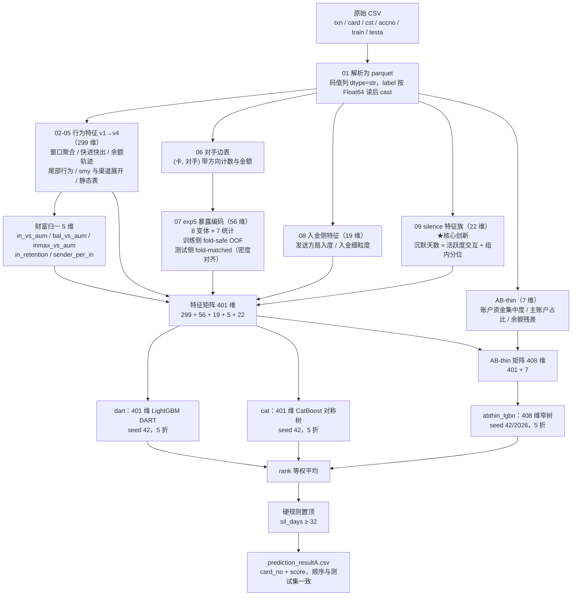

# 【选手姓名】-赛题X-审查材料说明

> 赛题：借记卡电信诈骗智能识别
>
> 本版覆盖 **初赛（A 榜）**。复赛（B 榜）部分待复赛结束后补充，占位见 §二（六）。

## 基本信息

| 项 | 内容 |
|---|---|
| 文件名称 | 《【选手姓名】-赛题X-审查材料说明》 |
| 联系人 UASS | 【待填写】 |
| 联系人 8 位员工编号 | 【待填写】 |
| 赛题编号 | 【待填写】 |
| A 榜最终成绩 | **0.916446（691/754）** |
| A 榜最终名次 | 【待填写】 |

---

# 一、算法介绍

## （一）解题思路

本题给定 5 张关联数据表（交易流水、客户、卡号、账号、标注），需预测约 7.5 万张借记卡发生电信诈骗的概率。

### 1. 评分口径决定优化方向

评分规则为：按预测概率降序取前 1% 判为欺诈，计算 F1。训练集欺诈率恰为 1%（3000/300000），因此在 top1% 处 Precision ≈ Recall ≈ F1。由此确立三条基本原则：

- **只有排序重要，概率校准无意义**。所有单调变换（rank 归一化、多模型 rank 平均）不改变得分，因此全流程统一采用 **rank 平均**融合。
- **线下验证必须复现线上口径**：`OOF 按分数取 top3000 的命中数 / 3000`，AUC/KS 仅作辅助。
- **A 榜 testA 共 75,400 卡，top1% = 754**。实测线上分数恰为 754 的整数分之一（例如 0.908488 = 685/754），说明测试集正样本数亦为 754，**每命中 1 张卡 = +0.001326**。这个换算贯穿全程的方案取舍。

### 2. 时间窗口的特殊性

交易流水的窗口是「**每张卡各自最近一笔交易往前倒推 30 个自然日**」，锚点是每卡自己的末笔交易时间，而非统一的日历日。因此：

- 所有时序特征均按**相对天数**构造（距该卡末笔的 T-1 / T-3 / T-7 / T-30）；
- 绝对日期只在确认三组（train label0 / label1 / testA）分布无组间漂移后，才作为独立特征引入（见下文 silence 特征族）。

### 3. 核心创新：silence 特征族

这是本方案相对常规做法的主要增量来源（**线上 +0.025**，占总提升的绝大部分）。

**出发点**不是"再想一个特征"，而是"**哪一块信息模型完全没有**"。窗口按相对天数处理后，有一个绝对量被完全丢弃了：

```
sil_days = (全量末笔日期的最大值) − (该卡末笔日期)
```

它刻画「这张卡沉默了多久」。电诈卡的终态是：受害人最后一笔汇入到账后，流水戛然而止（疑似被止付/冻结），因此沉默天数显著高于正常卡。

**判别力实测**

| 指标 | 数值 |
|---|---|
| 单变量 AUC | **0.7702**（label1 均值 16.61 天 vs label0 7.92 天） |
| 与已有 299 维行为特征的最高相关 | **0.491** |

第二行是引入它的**决定性依据**——相关性只有 0.49，说明这是一块模型此前**完全无法表达**的信息，而非已有特征的重复组合。

**与活跃度的强乘性交互**（欺诈率，行=沉默天数，列=笔数分位）

| | Q1 | Q3 | Q4 | Q5 |
|---|---|---|---|---|
| 沉默 1 天 | 0.13% | 0.14% | 0.08% | 0.14% |
| 沉默 8–14 天 | 0.31% | 1.67% | 6.09% | 25.39% |
| 沉默 15+ 天 | 0.60% | 5.33% | **22.10%** | **57.72%** |

`Q5 × 15+` 一格：835 张卡里 482 张是欺诈。三个高危格合计 3,228 张卡（占 1%），装了 **1,034 张欺诈，占全部的 34%**。

**关键设计**：原始 `sil_days` 本身价值有限（模型内 gain 仅 260），价值几乎全部来自**交互项**与**组内分位**：

| 特征 | 含义 | 全 401 维内 gain 排名 |
|---|---|---|
| `sil_pct_in_ntxn_bin` | 同笔数分箱内的沉默分位 | **第 4** |
| `ntxn_x_sil` | log(笔数) × 沉默天数 | **第 5** |
| `sil_days` | 原始沉默天数 | 第 250 名开外 |

组内分位这类特征 GBDT 学不出来（树无法在叶子内做全局排序），必须显式构造；而乘积项虽然 GBDT 能近似，显式给出可节省树深。silence 族合计占模型 **13.8%** 的 gain。

**泛化性验证**：train 与 testA 两侧的高沉默尾部占比高度一致（sil≥30 分别为 1.80% / 1.78%），确认该特征不是训练集独有的伪影。线上实测兑现 +0.0239。

### 4. 账户/余额 AB-thin 特征

原 401 维特征主要在卡粒度聚合，但 `acct_bal` 与 `accno_txn_sn` 的自然
归属是 `(card_no, cst_accno)`。若一卡多账户时直接串联，容易把账户切换
误当成余额跃迁。因此先在账户内按 `(tms, accno_txn_sn)` 排序计算余额残差，
再聚合到卡粒度。最终只保留 7 个预先固定、语义互补的特征：

| 类别 | 特征 |
|---|---|
| 账户资金集中度 | `AB_acc_in_hhi`, `AB_acc_out_hhi` |
| 主账户资金占比 | `AB_primary_in_share`, `AB_primary_out_share` |
| 余额一致性 | `AB_relresid_after_mean`, `AB_acc_resid_best_p90_mean`, `AB_resid_after_p90` |

这 7 维只加入窄树 LightGBM，DART 与 CatBoost 仍使用基础 401 维。最终
`abthin_w100` 表示在三族融合中**完全以 408 维 AB-thin lgbn 替换原 401
维 lgbn**，并不表示三个模型族的融合权重发生变化。线上由 690/754 提升
到 **691/754，即 0.916446**。特征构造不使用标签，只使用每卡自身流水及
静态账户归属。

### 5. 暴露编码的标签密度修正

`exp5` 暴露编码刻画「该卡的交易对手，在参考集里关联过多少张已知欺诈卡」，采用 8 个变体（账号/名称 × 全部/出金/入金/低度数/对私）× 7 个统计量，共 56 维，并做 fold-safe 处理。

初版实现存在一处**系统性口径错位**：

| | 参考集规模 | 正样本数 |
|---|---|---|
| 训练侧（每折） | 240,000 卡 | 2,400 |
| 测试侧 | 300,000 卡 | 3,000 |

计数型统计量（`nf_max` 等）随参考集规模线性放大，导致测试侧被系统性抬高 **24.6%**（实测 `ao_nf_max` 训练侧均值 505.8 vs 测试侧 630.1，比值 1.246 = 300/240），而树的分裂阈值是在 4/5 尺度上学到的。

**修正**：第 k 折的模型，使用「以该折自己的 4/5 训练折为参考集」重算的测试编码（fold-matched），两侧标签密度完全一致。

**验证方式**：仅用 56 维 exp5 训练一个分类器区分 train 与 testA（对抗验证）

| | 对抗 AUC | 最可分辨的维度 |
|---|---|---|
| 修正前 | **0.9695** | 全部是 `*_nf_max` |
| 修正后 | **0.4989** | 随机杂项 |

0.9695 意味着仅凭这 56 维就能以 97% 的判别力认出一张卡属于哪一侧。修正后降至 0.4989（0.5 = 两侧同分布），机制完全闭环。该修正同时带来 5 份编码平均的方差缩减，且不改变训练侧任何内容（OOF 完全不变）。

### 6. 最终模型的选择依据

最终提交并非"线下 OOF 分数最高"的方案，而是 **dart + abthin_lgbn + cat 三族 rank 等权平均**。理由如下。

在数十轮实验中观察到，线下 OOF 分数与线上成绩**已经脱钩**：

| 提交方案 | 线下 OOF | 线上 TP |
|---|---|---|
| 单模 LightGBM（7 seed） | 2762 | 685 |
| dart + R9（线下最高） | **2780** | 688 |
| dart + 原 401 维 lgbn + cat | 2773 | 690 |
| **dart + 408 维 abthin_lgbn + cat（最终）** | 2775 | **691** |
| bagging（14 随机超参） | 2772 | 685 |

线下最高的方案在线上并非最好。进一步的证据是：同样的特征与超参，在折种子 42 下线下为 2762–2778，换成其它折种子只有 2743–2758。这说明**长期在同一折结构上做模型选择，已对该折结构过拟合**，线下分数被系统性高估。

因此最终采用**成员多、结构异构**的组合：

| 成员 | 结构特点 |
|---|---|
| `dart` | LightGBM DART，训练时随机丢弃已有树 |
| `abthin_lgbn` | LightGBM 窄树（leaves=15, lr=0.03, ff=0.6），基础 401 维追加 7 维 AB-thin |
| `cat` | CatBoost，对称（oblivious）树 |

三者结构差异大，选择性过拟合被平均得最彻底。A 榜实测中，最终方案
`abthin_w100` 得分 **0.916446 = 691/754**，比原三族基线
`0.915119 = 690/754` 多命中 1 张。后续 3 维压缩、序号特征、参数扰动、
增 seed 与折内剪枝均未获得更高线上或稳定性证据，故不纳入最终复现链路。

### 7. 硬规则

train 中 `sil_days ≥ 32` 的 8 张卡**全部为欺诈**（命中率 100%），而 `sil_days = 31` 时欺诈率仅 4.72%——阈值处存在断崖。反推数据抽取规则：正常卡要求末笔交易在窗口起点之后（以保证完整 30 天窗口），而欺诈卡从名单直接取，不受此约束。故对测试集中满足该条件的卡直接置顶。

## （二）模型流程图

> 请将下方 Mermaid 源码渲染为图片后替换本处（可用 <https://mermaid.live> 在线导出 PNG）。



## （三）模型介绍

### 1. 预处理阶段

按数据字典逐表分析，设计加工逻辑，全部聚合到**卡（card_no）维度**。要点：

- 码值列（`txn_channel_type` / `txn_cgycd` / `smy_cd` / `occupation` / `gender` / `marital_status`）含前导零，必须以 `dtype=str` 读取；
- `train.csv` 的 `label` 为 `"0.0"/"1.0"` 浮点文本，需先按 `Float64` 读入再 `cast` 为整型；
- 一卡多账号：`txn` 按 `(card_no, cst_accno)` 记录。AB-thin 的余额差分必须先在该账户键内按 `(tms, accno_txn_sn)` 排序，再聚合到卡粒度，禁止把不同账户的相邻交易拼成余额轨迹；
- 缺失值（`marital_status` 49%、`industry` 82%、`ovsea_bsn_opn_ind` 48%）交由 LightGBM 原生处理，不填充；暴露编码缺失填 0（语义为"无暴露"）。

### 2. 训练阶段

- 5 折 `StratifiedKFold(shuffle=True, random_state=42)`；
- **折划分种子固定为 42**——`exp5` 暴露编码是在该折下 fold-safe 生成的，若模型训练换用其它折种子，验证折样本的编码会包含其自身 label，构成标签泄露；
- 早停 `early_stopping(100)`，`metric="auc"`；
- DART 与 CatBoost 使用基础 401 维；窄树 LightGBM 使用 401 维加 7 维 AB-thin，共 408 维；
- 融合一律用 `rankdata` 后平均，不做权重搜索（在 OOF 上搜索融合权重会带来 0.011–0.016 的虚高）。

### 3. 输出阶段

三个族（`dart`、`abthin_lgbn`、`cat`）各自 rank 归一后等权平均，
施加硬规则，最后**用测试集主键 left join 回填**以保证行数与顺序完全一致，
输出 `card_no + score` 两列 CSV。这里的 `w100` 表示在 lgbn 族内 100% 使用
AB-thin 模型，并不表示三族融合权重为 100%。

---

# 二、代码清单与运行指令

## （一）数据预处理过程描述

预处理与特征加工共 9 个脚本，**必须按编号顺序执行**（存在依赖关系）：

| 脚本 | 作用 | 输出 | 耗时 |
|---|---|---|---|
| `code/train/01_parse_raw.py` | 原始 CSV → parquet，完整性与时间锚点检查 | `txn/card/cst/accno/train/testa/anchor.parquet` | ~3 min |
| `code/train/02_features_v1.py` | 卡级基础特征（94 列） | `features_v1.parquet` | ~2 min |
| `code/train/03_features_v2.py` | 尾部行为 / 对手网络 / 熵 / 金额形态（142 列） | `features_v2.parquet` | ~2 min |
| `code/train/04_features_v3.py` | 末段序列 / 末次入金后行为 / 分散转出（174 列） | `features_v3.parquet` | ~3 min |
| `code/train/05_features_v4.py` | smy 与渠道全量展开 + 末段小时级时间窗（300 列） | `features_v4.parquet` | ~3 min |
| `code/train/06_edge_tables.py` | (卡, 对手) 带方向边表 | `edge_acc2/edge_nm2.parquet` | ~2 min |
| `code/train/07_exp5_encoding.py` | 暴露编码，训练侧 fold-safe + 测试侧 fold-matched | `exp5_tr.parquet`, `exp5_te_f0~4.parquet` | ~8 min |
| `code/train/08_inflow_feat.py` | 入金侧 label-free 特征（19 维） | `inflow_feat.parquet` | ~2 min |
| `code/train/09_silence_feat.py` | **silence 特征族（22 维）** | `silence_feat.parquet`, `silence_anchor.json` | ~2 min |

> 特征矩阵的最终组装由 `code/assemble.py` 完成，**训练与预测共用同一份代码**，从机制上杜绝两侧口径漂移。财富归一 5 维在该模块内计算。
>
> `code/account_balance.py` 由第 10 步自动调用，生成
> `account_balance_v1.parquet` 并只向窄树族追加固定 7 维 AB-thin 特征；
> 该过程不使用标签，无需单独执行。

## （二）模型训练过程描述

**安装依赖**

```bash
pip install -r requirements.txt
```

**所需环境**

```text
Python 3.10.16
Linux（5 CPU / 20GB 内存即可，无需 GPU）
```

**算法**

```text
401 维 LightGBM DART + 408 维 AB-thin LightGBM 窄树 +
401 维 CatBoost，三族 rank 等权平均
```

**训练文件**

```text
code/train/10_train_models.py
```

**一键执行（含全部特征加工）**

```bash
bash code/scripts/run_train.sh
```

或分步执行 `code/train/` 下 01 至 10 的脚本。

**训练产出**

| 路径 | 内容 |
|---|---|
| `model/dart_s42_f{0..4}.txt` | DART 模型，5 个 |
| `model/abthin_lgbn_s{42,2026}_f{0..4}.txt` | 408 维 AB-thin 窄树模型，10 个 |
| `model/cat_s42_f{0..4}.cbm` | CatBoost 模型，5 个 |
| `model/feature_cols.json` | DART/CatBoost 的 401 维列顺序 |
| `model/account_balance_thin_feature_cols.json` | AB-thin 窄树的 408 维列顺序 |
| `data/interim/oof_*.npy` | 各族 OOF，供线下核对 |

总耗时约 **2.5 小时**，其中 DART 约 78 分钟为主要开销。

## （三）模型预测过程描述

**预处理结果文件**

```text
data/interim/features_v4.parquet
data/interim/exp5_te_f0~4.parquet
data/interim/inflow_feat.parquet
data/interim/silence_feat.parquet
data/interim/account_balance_v1.parquet
```

**预测命令**

```bash
bash code/scripts/run_predict.sh testa
```

等价于：

```bash
PYTHONPATH=code python code/test/predict.py testa
```

该脚本**只加载 `model/` 下已训练好的模型，不重新训练**，耗时约 3 分钟。

**输出结果**

```text
prediction_result/prediction_resultA.csv
```

格式为 `card_no,score` 两列，行数与顺序与 `data/testA/testa.csv` 完全一致（脚本内含 `assert` 校验）。

## （四）代码结构

```text
赛题X-借记卡电信诈骗智能识别/
│
├── 【选手姓名】-赛题X-审查材料说明.pdf   # 本文档
├── requirements.txt                      # 环境依赖
│
├── data/
│   ├── README.md                         # 数据放置说明（数据本身未打包，见下）
│   ├── train/                            # 放 *_train_testa.csv + train.csv
│   ├── testA/                            # 放 testa.csv
│   ├── testB/                            # 复赛数据
│   └── interim/                          # 中间 parquet，由脚本自动生成
│
├── model/                                # 训练产出的 20 个最终模型 + 两份列顺序
│
├── prediction_result/
│   └── prediction_resultA.csv            # A 榜提交结果
│
└── code/
    ├── config.py                         # 全局配置：路径、折种子、超参、最终配方
    ├── assemble.py                       # 401 维特征矩阵组装（训练/预测共用）
    ├── account_balance.py                # 固定 7 维 AB-thin（训练/预测共用）
    │
    ├── train/
    │   ├── 01_parse_raw.py
    │   ├── 02_features_v1.py
    │   ├── 03_features_v2.py
    │   ├── 04_features_v3.py
    │   ├── 05_features_v4.py
    │   ├── 06_edge_tables.py
    │   ├── 07_exp5_encoding.py
    │   ├── 08_inflow_feat.py
    │   ├── 09_silence_feat.py
    │   └── 10_train_models.py
    │
    ├── test/
    │   └── predict.py                    # 加载模型 -> 提交文件
    │
    └── scripts/
        ├── run_train.sh                  # 一键训练
        └── run_predict.sh                # 一键预测
```

> **关于数据**：赛题数据为行内脱敏数据，未随材料打包。请按 `data/README.md` 放置原始 CSV。若数据位于其它路径，可设置环境变量 `FRAUD_BASE`，或直接修改 `code/config.py` 顶部的路径常量（全部路径集中于该文件，只需改一处）。

## （五）复现情况预估

执行上述脚本后将生成：

- A 榜结果：`prediction_result/prediction_resultA.csv`

**预期误差为 0，可完全复现。** 依据：

1. 全流程无任何随机性未受控——折划分 `random_state=42`，各模型 `seed` 在 `config.FINAL_RECIPE` 中显式指定；
2. 特征加工全部为确定性聚合，不含采样；
3. 融合为固定等权 rank 平均，无权重搜索；
4. `predict.py` 直接加载落盘模型，与训练时的 `best_iteration` 完全一致（保存时已用 `num_iteration=best_iteration` 截断）。

线上已验证文件为 `abthin_w100.csv`，成绩 **0.916446（691/754）**。
审查包中的正式文件名统一为 `prediction_resultA.csv`；二者采用同一模型、同一
三族融合公式及同一硬规则，仅文件名不同。

若从零重跑训练（`run_train.sh`），因 LightGBM 在不同 CPU 核数下的浮点累加顺序可能有微小差异，`best_iteration` 存在极小概率偏移，预估 top754 变动不超过 3 张卡。**建议评审直接使用随材料提交的 `model/` 目录执行预测**，此路径误差严格为 0。

## （六）复赛（B 榜）说明

> 待复赛结束后补充。届时需说明：
>
> - `testB` 侧特征加工（复用 01–09 同一份代码，`07_exp5_encoding.py` 传入参数 `testb`）；
> - `predict.py testb` 生成 `prediction_resultB.csv`；
> - **silence 锚点的复核结果**（见下方常见问题 §一）。

---

# 三、常见问题解答

## （一）问题 1：silence 特征的时间锚点

**问题描述**

`silence_feat.parquet` 中的 `sil_days` 依赖一个全局锚点（A 榜为 `2026-01-01`，即 train+testA 全量末笔日期的最大值）。该特征族贡献了模型 13.8% 的 gain，若复赛数据的末笔日期分布整体平移而未察觉，`sil_days` 会系统性错位，导致成绩大幅下滑。

**解决方案**

1. 锚点已写入 `data/interim/silence_anchor.json`，可追溯；
2. 复赛数据到手后，**第一步**先统计 `testB` 的末笔日期日级分布，与 train / testA 对齐核对（A 榜实测：label0 的末笔日期全部 ≥ 窗口起点，全量末笔日最大值为 2026-01-01）；
3. 若分布一致，沿用同一锚点；若整体平移，改用 `testB` 自身末笔日期的 P99.9 分位作为锚点，**并同步重算训练侧的 `sil_days`**，保持两侧同一相对基准。绝不可让两侧各自取自己的最大值，那会使 `sil_days` 不可比。

## （二）问题 2：折划分种子不可更改

**问题描述**

若将 `config.FOLD_SEED` 改为 42 以外的值，线下 OOF 分数会异常升高，但线上成绩崩溃。

**解决方案**

`exp5` 暴露编码是在 `StratifiedKFold(5, random_state=42)` 下 fold-safe 生成的：每折的编码只使用其余 4 折的 label。若模型训练换用其它折种子，新的验证折样本会落入旧编码的"训练折"中，其编码包含自身 label，构成泄露。

如确需更换折种子，必须**整套重建** `exp5`（训练侧 OOF 编码 + 5 份 fold-matched 测试编码），即以新种子重跑 `07_exp5_encoding.py` 并删除旧缓存。

## （三）问题 3：依赖库版本

**问题描述**

- `numpy` 升至 2.x 后，LightGBM / CatBoost 可能崩溃；
- `pyarrow` 升至 17.x 时报 `GLIBCXX_3.4.21 not found`（系统 libstdc++ 版本较低）。

**解决方案**

严格按 `requirements.txt` 安装：`numpy==1.26.4`、`pyarrow==12.0.1`。已在文件内加注释说明。

## （四）问题 4：内存占用

**问题描述**

`txn` 表约 997 万行 / 2.2GB；`06_edge_tables.py` 与 `07_exp5_encoding.py` 需同时载入两张 450 万行的边表并派生 8 个变体。

**解决方案**

实测在 5 CPU / 20GB 内存环境下可稳定运行，峰值约 4GB。各脚本已做分步落盘与 `del` + `gc.collect()` 释放，可逐个执行而非一次性载入。若内存更紧张，可按脚本编号分批执行，中间产物均已持久化至 `data/interim/`。

## （五）问题 5：中间产物已存在时的行为

**问题描述**

`07_exp5_encoding.py` 对已存在的编码文件会跳过重算；
`code/account_balance.py` 会复用已有的 `account_balance_v1.parquet`。

**解决方案**

这是为断点续跑设计的。若需强制重算（例如更换了折种子），请先删除
`data/interim/exp5_tr.parquet` 与 `data/interim/exp5_te_f*.parquet`。
若需重算账户特征，则删除 `data/interim/account_balance_v1.parquet` 后重新
运行第 10 步。其余训练前处理脚本均为无条件覆盖写入。
